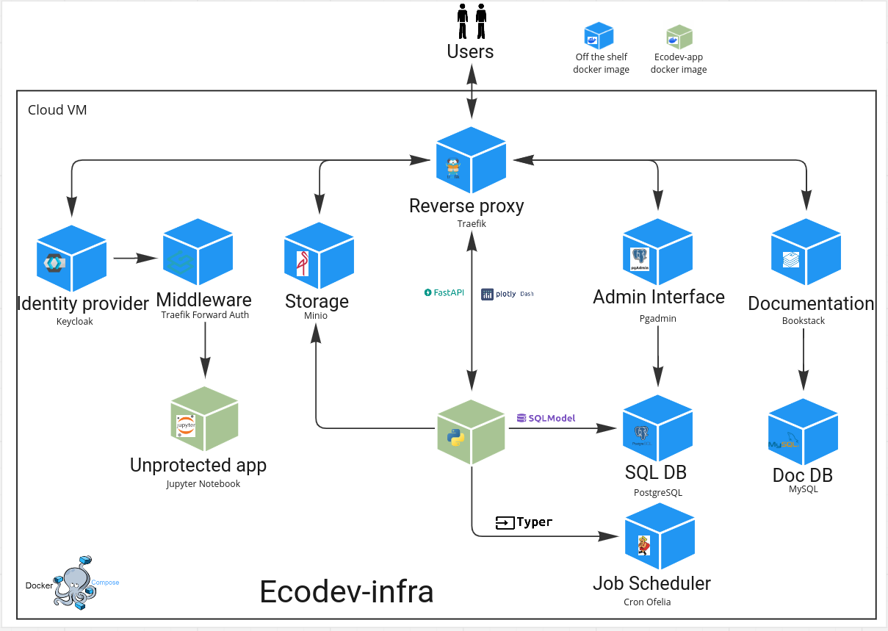

# Docker-compose devoops

Repo taking off the shelf docker images for 
- traefik
- postgresql db and pgadmin interface
- bookstack and its associated db
- keycloak and traefik forward-auth (to protect apps that cannot implement authentication without keycloak)
- minio (back and front)
- ofelia

 

    <em>Ecodev infra in a nutshell</em>

Documentation can be found [here](https://ecodev-doc.lcabox.com/cookiecutters/infra/)